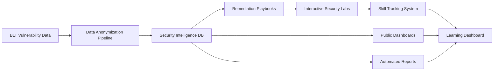

# **Blt-education & Knowledge Sharing: Hands-On Code-Centric Security Labs & Community Intelligence (350 hr)**

#### This project transforms BLT's existing theory-heavy labs into hands-on, code-centric security exercises while establishing a community-driven knowledge sharing pipeline.
Learners analyze real vulnerable code and configurations, identify security flaws, reason about how they could be exploited, and then apply secure fixes. Anonymized vulnerability patterns are aggregated into public dashboards, monthly reports, and remediation playbooks—creating a feedback loop where learning informs intelligence sharing and vice versa.
The focus is on security thinking, inspired by OWASP Top 10, ethical hacking workflows, and CTF-style reasoning, but scoped for maintainability and learning depth. 

**Each lab follows a three-step workflow:**
- Identify the vulnerability
(What is wrong? Where is it?)

- Explain the exploitation scenario
(How could this be abused? What is the impact?)

- Apply or select the secure fix
(Correct remediation pattern + explanation)

**Goals**
- Deliver 6–8 hands-on labs that teach real security reasoning (OWASP Top 5 focus)
- Establish a safe, anonymized security intelligence pipeline for public sharing
- Create a feedback loop where real patterns improve labs and playbooks
- Maintain backward compatibility with existing theory-based labs
- Enable future gamification and integrations (BACON/badges, NetGuardian mapping)

**Core Features (brief)**
- Multi-step lab validation (Identify → Explain → Fix) with partial credit
- Lab schema, hints, difficulty ratings, and progress tracking
- Data anonymization + aggregation for BLT issues/PRs
- Public dashboard for trends and severity distribution
- Monthly/quarterly reports with two-person approval workflow
- Remediation playbooks converted into mini interactive challenges

**Unified Architecture**

**Proposed Timeline**
- Phase 1 (Weeks 1–4 | ~100 hours):
  - Week 1: Lab schema + validation foundations
    - Finalize Identify/Explain/Fix schema and validation rubric
    - Define partial credit rules and scoring breakdown
    - Draft example lab templates to validate the schema
  - Week 2: Validation backend + data anonymization start
    - Implement backend validation endpoints and scoring logic
    - Add persistence for attempts, scores, and feedback
    - Start anonymization pipeline (PII stripping + snippet sanitization)
  - Week 3: UI foundations + backward compatibility
    - Build step-wise UI flow (Identify → Explain → Fix)
    - Implement hints, progress tracking, and step feedback
    - Ensure existing theory labs continue to render correctly
  - Week 4: Anonymization + intelligence model setup
    - Complete aggregation logic and safe storage for anonymized data
    - Draft intelligence models (SecurityIntelligence, report metadata)
    - Validate anonymized outputs with sample datasets
  - AI-assisted support: help draft concise explanations

- Phase 2 (Weeks 5–8 | ~120 hours):
  - Week 5: SQL Injection labs
    - Create basic SQLi lab (union-based) with exploit reasoning
    - Create advanced SQLi lab (blind/time-based) with fixes
    - Add lab-specific hints and validation cases
  - Week 6: XSS labs
    - Build stored XSS lab (DOM analysis → sanitization fix)
    - Build reflected XSS lab (context analysis → CSP fix)
    - Add secure remediation explanations and comparisons
  - Week 7: Auth & Access Control labs
    - CSRF lab (token absence → token implementation)
    - IDOR lab (authorization checks → secure access)
    - Session/auth flaws lab with impact analysis
  - Week 8: Integration + quality pass
    - Add difficulty ratings and prerequisites
    - Enable lab metrics (completion, accuracy, hints used)
    - End-to-end lab testing + feedback iteration

- Phase 3 (Weeks 9–11 | ~110 hours):
  - Week 9: Public intelligence dashboard
    - Define dashboard KPIs (top categories, severity trends, remediation time)
    - Build aggregated visualizations from anonymized data
    - Ensure pre-disclosure filtering and safe data exposure
  - Week 10: Reporting + approvals
    - Generate monthly/quarterly reports (Markdown/PDF)
    - Implement two-person approval workflow + admin review UI
    - Add notifications for review/approval steps
  - Week 11: Playbooks + unified dashboard
    - Create 3 remediation playbooks from anonymized patterns
    - Convert playbooks into mini-challenges with examples
    - Build unified learning dashboard (progress + skill coverage)
  - Optional AI support: suggest next labs based on skill gaps

- Phase 4 (Week 12 | ~20 hours): 
  - E2E testing (labs, dashboards, reports)
  - Documentation (lab creation guide, data anonymization policies, API reference)

**Benefits**
- Helps contributors learn how to think like security reviewers
- Improves quality of future vulnerability reports and PRs
- Transforms BLT data into actionable community intelligence
- Creates feedback loop: real vulnerability patterns → better labs → improved remediation guidance
- Builds community trust through transparent, anonymized security insights

**Next-Steps**
- Integrate with badges/BACON gamification for learning achievements
- Map NetGuardian findings to relevant learning labs automatically
- Enable two-person approval workflow for sensitive security content
- Establish public API for community access to security intelligence
- Can later evolve into a dedicated security learning playground, enabling richer lab types, additional vulnerability categories, and deeper practice

---

_Last Updated: February 2026_
